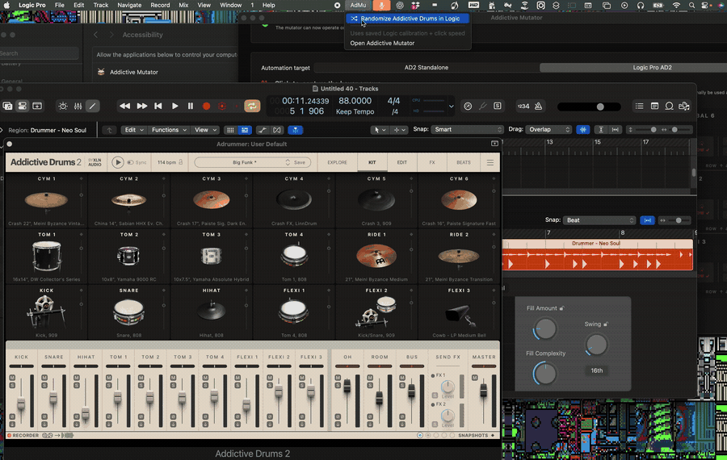

# Addictive Mutator

<p align="center">
  
</p>

An open-source macOS companion for procedurally mutating the visible Addictive Drums 2 Kit page. It is built for finding unexpected kit combinations quickly while keeping your groove and mix workflow intact.

## What it does

- Maps all 18 AD2 Kit-page slots: Cym 1–6, Tom 1–4, Ride 1–2, Kick, Snare, Hi-hat, and Flexi 1–3.
- Lets you include or skip every drum slot independently.
- Randomly selects a captured Up or Down direction and a click-burst length for each enabled slot.
- Runs slots in AD2’s physical Kit-page order to reduce pointer travel.
- Stores your mappings, slot switches, and click-speed setting locally across restarts.
- Keeps Logic Pro and standalone AD2 calibrations separate, with an optional Logic-to-standalone fallback for matching layouts.
- Includes a compact `AdMu` menu-bar command to randomize an already-mapped Logic Pro AD2 editor.

The default is Quiet pointer mode at 30 ms. Raise the interval if a particular AD2 setup misses clicks.

## How it works

Addictive Mutator uses macOS Accessibility to operate the AD2 controls you map on screen. It does not inspect your sample library, alter AD2 files, or reverse engineer/generate preset files.

1. Open AD2 on its Kit page, either standalone or in Logic Pro.
2. Capture each desired slot’s hover position and its Up and/or Down arrow once.
3. Turn on only the kit pieces you want to mutate.
4. Click **Mutate kit** or use **AdMu** for Logic Pro.
5. Audition the result and save it through AD2 whenever you want to keep it.

Your direct standalone mappings take precedence. If enabled, the app can use unmapped standalone controls from your Logic map as a fallback; test one arrow when changing host or AD2 UI zoom.

## Install

Download the latest release from [GitHub Releases](https://github.com/santismo/addictive-mutator/releases).

- **`.pkg`** — opens macOS Installer and installs Addictive Mutator in Applications.
- **`.dmg`** — open it and drag Addictive Mutator to Applications.

The current release is unsigned. If macOS blocks the first launch, approve it in System Settings → Privacy & Security, then enable **Addictive Mutator** in Accessibility.

## Build from source

```bash
cd desktop
swift run
```

Create distributable installers:

```bash
cd desktop
./scripts/package-macos-app.sh 'Addictive Mutator.app'
./scripts/create-dmg.sh 'Addictive Mutator.app' 'Addictive Mutator.dmg'
./scripts/create-installer-pkg.sh 'Addictive Mutator.app' 'Addictive Mutator.pkg'
```

## Compatibility and boundaries

- Requires macOS 14 or later and Accessibility permission.
- Works only with the AD2 interface that is visible and ready to receive clicks.
- UI zoom and host-window chrome can change coordinate geometry. Captures survive normal window moves and proportional resizes; recapture or test a slot after a meaningful AD2 layout change.
- Addictive Drums, AD2, ADpaks, Kitpiece Paks, presets, samples, and associated trademarks belong to XLN Audio. This project includes none of them.

## License

MIT License — Copyright © 2026 Santismo. See [LICENSE](LICENSE).
